<div align="center">
  <h1>👋 Hi, I'm Hitesh Kumar</h1>
  <b>I'm a passionate developer from India.</b>
</div>

<div align="center">
   
  ✨ Learn more about me on my [portfolio](https://hiteshverse.github.io). <br>
  💻 Find more of my projects [here](https://github.com/hiteshverse?tab=repositories). <br>
  💌 You can reach me via email at [authreborn@gmail.com](mailto:authreborn@gmail.com).
</div>

<div align="center">
  <a href="#"></a>
  <details>
    <summary>See more</summary>
    <a href="#"></a> <br>
    <a href="#"></a>
    <details>
      <summary>About me</summary>
      <div align="left">

```js
/**
 * Represents me.
 * @constructor
 * @param {string} languages - Hindi, Gujrati, English.
 * @param {string} hobbies - Anime, Music, Gaming.
 * @param {string} interests - AI, Open Source, Javascript.
 * @param {Date} birthday - 20th of Dec.
 */
```
  </div>
</details>

<details>
  <summary>Status</summary>
  <div>
    <a href="#"></a><br>
    <a href="https://discord.com/users/901270070406299708" target="_blank">
      
    </a>
  </div>
</details>
  </details>
  <a href="#"></a>
</div>
<div align="center">
  <a href="https://x.com/hiteshverse" target="blank"></a> &nbsp;&nbsp;<a href="https://linkedin.com/in/hiteshverse" target="blank"></a> &nbsp;&nbsp;
  <a href="https://instagram.com/hiteshverse" target="blank"></a>
</div>
